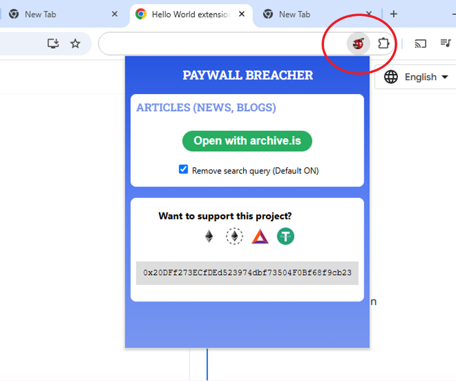

# Paywall Breacher Chrome Extension

## Introduction

This is an unpacked chrome extension that offer a simple GUI for bypassing paywalls in the browser.



## Installation

To load an unpacked extension in developer mode:

1. Clone or download the repo locally
   - If using the "Download Zip" option. Extract the zip file.
2. Go to the Extensions page by entering chrome://extensions in a new tab
   - Alternatively, click the Extensions menu puzzle button and select Manage Extensions at the bottom of the menu.
   - Or, click the Chrome menu, hover over More Tools, then select Extensions.
3. Enable Developer Mode by clicking the toggle switch next to Developer mode.
4. Click the Load unpacked button and select the extension directory (`/src`)
5. The extension will appear in the extensions bar-menu and is ready to use
6. You can find the extension in the extensions toolbar dropdown and click the pin icon to pin it to the chrome toolbar

## Usage

1. When you open a page/article behind a paywall, click on the chrome extension to open a popup window
2. Click the green button
3. The browser window will redirect to an archived version of the webpage that should allow you to view it without the pay wall
4. Search queries are removed from urls by default, if this is causing an issue, you can uncheck the checkbox under the green button and re-attempt

## Support

You can support this project by donating ERC20 tokens to this address:

```text
0x20DFf273ECfDEd523974dbf73504F0Bf68f9cb23
```
